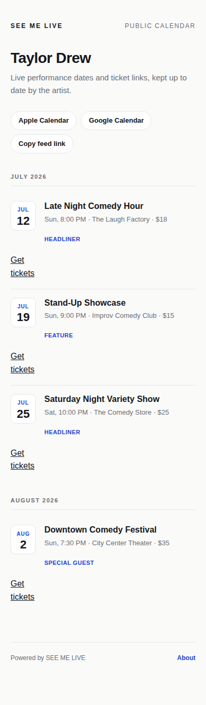
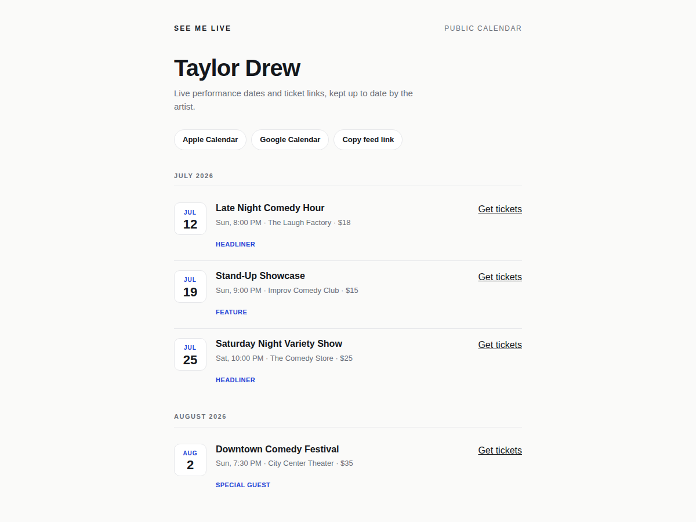

<div align="center">
  
  <h1>SEE ME LIVE</h1>
  <p><strong>The calendar app built for live performers.</strong><br/>Add a show once — stay in sync everywhere.</p>

  
  
  
  
  
</div>

---

SEE ME LIVE is a native iOS app for touring performers — comedians, musicians, speakers, and anyone with a live show schedule. Enter a gig once and it syncs privately across your Apple devices, mirrors to a public fan-facing calendar, and turns into a shareable promotional flyer — all without leaving the app.

## Table of Contents

- [Features](#features)
- [Public Web Calendar](#public-web-calendar)
- [Flyer Studio](#flyer-studio)
- [iCalendar Feed](#icalendar-feed)
- [Tech Stack](#tech-stack)
- [Architecture](#architecture)
- [Data Model](#data-model)
- [Getting Started](#getting-started)
- [CloudKit Setup](#cloudkit-setup)
- [Calendar Feed Deployment](#calendar-feed-deployment)
- [Running Tests](#running-tests)
- [Project Structure](#project-structure)

---

## Features

### Show Management
- Add and edit shows with title, venue, date, time, price, ticket link, performer role, and notes
- Attach a flyer photo from your camera roll or take one in-app
- Calendar-first home screen with a full month view and scrollable upcoming list
- Search across shows by title, venue, role, or notes

### Sync & Calendars
- **Private iCloud sync** via `NSPersistentCloudKitContainer` — your data syncs across all your Apple devices automatically
- **Public CloudKit mirror** — each show is written to a public database so fans can view your schedule at your personal link
- **EventKit integration** — optionally add any show to your iPhone's built-in Calendar app with a one-hour reminder
- **Offline-resilient** — failed syncs are queued and retried when you come back online

### Sharing
- Generate promotional flyers for Instagram, TikTok, Twitter/X, and Facebook with one tap
- Six social format presets (9:16, 1:1, 16:9, 1.91:1)
- Custom backgrounds: solid color, gradient, or photo
- Text overlays with full control over position, rotation, font size, weight, color, shadow, and outline
- Save generated images directly to your photo library

### Public Calendar
- Every performer gets a unique public URL (`https://seemelive.vercel.app/?user=YOUR_ID`)
- Shows appear grouped by month with ticket links and your performer role
- Fans can subscribe with Apple Calendar, Google Calendar, or any app that supports iCalendar feeds

---

## Public Web Calendar

Your public calendar is a fast, mobile-first webpage that fans and bookers can bookmark — no account required on their end.

<div align="center">
  
</div>

**What fans see:**
- Your name as the calendar header
- Shows grouped by month with date, time, venue, price, and your performer role
- "Get tickets" links directly to your ticketing page
- Subscribe buttons for Apple Calendar and Google Calendar

**Desktop view:**

<div align="center">
  
</div>

The page uses the CloudKit JS SDK to pull live data from the public database — so any show you add or delete in the app is reflected on the web immediately.

---

## Flyer Studio

The built-in flyer studio generates ready-to-post promotional images from your show data. Pick a social format, customize the look, and export straight to your photo library.

**Format presets:**

| Preset | Ratio | Use case |
|--------|-------|----------|
| IG Story | 9:16 | Instagram / TikTok Stories |
| IG Post | 1:1 | Instagram feed square |
| TikTok | 9:16 | TikTok feed |
| Twitter / X | 16:9 | Twitter card |
| Facebook / OG | 1.91:1 | Facebook post, link preview |
| Link Preview | 1.91:1 | General link meta image |

**Background styles:** gradient, dark, light, solid color, or your own photo.

**Text overlays:** drag to reposition, rotate, change font, weight, size, color, and add a shadow or outline. The watermark can be removed via an in-app purchase.

---

## iCalendar Feed

Every public calendar comes with a subscribable `.ics` feed. Fans can add your schedule to any calendar app — updates sync automatically when you change a show.

**Feed URL format:**
```
https://seemelive.vercel.app/calendar.ics?user=YOUR_USER_ID
```

**What's included in each calendar event:**
- Show title and performer role
- Date, time, and venue (as the event location)
- Ticket link
- Notes/description
- A stable unique ID so updates don't create duplicates

The feed is generated by a Vercel serverless function that queries the CloudKit public database and returns a valid RFC 5545 iCalendar file.

---

## Tech Stack

| Layer | Technology |
|-------|-----------|
| Language | Swift 5.0 |
| UI Framework | SwiftUI |
| Minimum OS | iOS 17+ |
| Local Storage | Core Data |
| Private Sync | NSPersistentCloudKitContainer |
| Public Database | CloudKit (public) |
| Calendar | EventKit |
| Photos | PhotosUI + AVFoundation |
| Purchases | StoreKit 2 |
| Image Rendering | UIKit Core Graphics |
| Web Calendar | HTML/CSS/JS + CloudKit JS SDK |
| Calendar Feed | Vercel serverless (Node.js 18+) |

No third-party Swift dependencies — the app is 100% native Apple frameworks.

---

## Architecture

The app is organized around five core services:

### PersistenceController
Manages the Core Data stack using `NSPersistentCloudKitContainer`. All show data lives here and syncs automatically to the performer's private iCloud account. Uses `NSMergeByPropertyObjectTrumpMergePolicy` to keep local changes from being overwritten during sync.

### PublicCloudSyncService
A separate service that writes show data to the CloudKit **public** database — the same records that power the web calendar. It is offline-resilient: shows that fail to sync are flagged with a `needsPublicSync` attribute and retried on the next app launch or foreground transition. Pending deletes are queued in UserDefaults and flushed on availability.

### CalendarService
An EventKit wrapper that creates and updates iPhone Calendar events. It maintains a custom "My Gig Calendar" calendar entry with a distinctive color and stores the EKEvent identifier inside each Core Data show record so future edits update the same event rather than creating duplicates.

### UserIdentityService
Generates a stable UUID on first launch, stores it in UserDefaults, and attaches it to every public CloudKit record. This UUID becomes the `?user=` parameter in your public calendar URL — it never changes, so shared links don't break when the app is reinstalled.

### PurchaseManager
Handles the StoreKit 2 in-app purchase for watermark removal (`comedy.SEEMELIVE.remove_watermark`). Observes transaction updates in real time and caches purchase state in UserDefaults so the entitlement persists across launches without a network call.

### ShareImageGenerator
Renders promotional images to `UIImage` using Core Graphics. Accepts a show record, a format preset, background style, and an array of text overlay descriptors. Images are JPEG-compressed before CloudKit upload to minimize storage costs.

---

## Data Model

The Core Data `Show` entity has 18 attributes:

| Attribute | Type | Notes |
|-----------|------|-------|
| `title` | String | Required |
| `venue` | String | Required |
| `date` | Date | Required |
| `role` | String? | Headliner, Feature, etc. |
| `price` | Double? | Ticket price |
| `ticketLink` | String? | URL |
| `notes` | String? | Freeform notes |
| `flyerImageData` | Binary? | JPEG, external storage |
| `calendarEventID` | String? | EKEvent identifier |
| `publicRecordID` | String? | CloudKit record name |
| `userID` | String | Stable UUID from UserIdentityService |
| `addToCalendar` | Boolean | Default: YES |
| `setReminder` | Boolean | Default: NO |
| `needsPublicSync` | Boolean | Offline retry flag |
| `pendingPublicDelete` | Boolean | Offline delete queue |
| `lastPublicSyncError` | String? | Error tracking |
| `createdAt` | Date | Required |
| `updatedAt` | Date | Required |

The CloudKit public database mirrors a subset of these fields in a `PublicShow` record type, excluding all local-only attributes like `calendarEventID` and `needsPublicSync`.

---

## Getting Started

**Prerequisites:**
- macOS with Xcode 15 or later
- iOS 17+ device or simulator
- Apple Developer account (required for CloudKit and App Store capabilities)
- Node.js 18+ (only needed for the calendar feed serverless function)

**Clone and open:**
```bash
git clone https://github.com/taylordrew4u2/seemelive.git
cd seemelive
open "SEE ME LIVE.xcodeproj"
```

Select the **SEE ME LIVE** scheme, choose a simulator or connected device, and press **Cmd+R**.

> **Note:** CloudKit features require a valid iCloud account on the device/simulator. The app detects iCloud availability at launch and gracefully disables sync if unavailable.

**Run the web calendar locally:**
```bash
npx vercel dev
# Web calendar: http://localhost:3000/?user=<YOUR_USER_ID>
# iCal feed:    http://localhost:3000/calendar.ics?user=<YOUR_USER_ID>
```

Your `YOUR_USER_ID` is shown in the app's share sheet when you tap the public calendar link.

---

## CloudKit Setup

See [`CLOUDKIT_SETUP.md`](CLOUDKIT_SETUP.md) for the full walkthrough. The short version:

1. Create an iCloud container named `iCloud.comedy.SEE-ME-LIVE` in your Apple Developer account.
2. In the CloudKit Dashboard, open the **public database** and create a `PublicShow` record type with these fields:

   | Field | Type |
   |-------|------|
   | `title` | String |
   | `role` | String |
   | `venue` | String |
   | `date` | Date/Time |
   | `price` | Double |
   | `ticketLink` | String |
   | `notes` | String |
   | `userID` | String |
   | `flyer` | Asset |

3. Add indexes on `userID` (Queryable), `date` (Queryable + Sortable), and `recordName` (Queryable).
4. Generate an API token for the CloudKit JS SDK (used by the web calendar).
5. In Xcode, confirm your signing configuration includes the **CloudKit** and **Background Modes → Remote Notifications** capabilities.

---

## Calendar Feed Deployment

See [`CALENDAR_FEED_SETUP.md`](CALENDAR_FEED_SETUP.md) for full details.

1. Deploy `docs/calendar.ics.js` to Vercel (or any Node.js serverless platform).
2. Set the environment variable `CLOUDKIT_API_TOKEN` to the token generated in the CloudKit Dashboard.
3. Update the feed URL in `docs/index.html` if you're using a custom domain.
4. Verify with:
   ```bash
   curl "https://your-domain.vercel.app/calendar.ics?user=SOME_USER_ID"
   ```
   You should get a `text/calendar` response in iCalendar format.

---

## Running Tests

The test suite covers all core services and utility layers.

**In Xcode:** Select the **SEE ME LIVETests** scheme and press **Cmd+U**.

**From the command line:**
```bash
xcodebuild test \
  -scheme "SEE ME LIVE" \
  -destination "platform=iOS Simulator,name=iPhone 15"
```

| Test File | Coverage Area |
|-----------|--------------|
| `PersistenceTests.swift` | Core Data stack, save/fetch, merge policy |
| `HTMLExportServiceTests.swift` | HTML generation logic |
| `ShareImageGeneratorTests.swift` | Image rendering with presets and overlays |
| `ShowExtensionsTests.swift` | Convenience accessors, date formatting |
| `UserIdentityServiceTests.swift` | UUID generation and persistence |
| `PurchaseManagerTests.swift` | Purchase state, product loading, transactions |

---

## Project Structure

```
seemelive/
├── SEE ME LIVE/                      # iOS app source (~7,850 lines of Swift)
│   ├── SEE_ME_LIVEApp.swift          # App entry point, splash → onboarding → home flow
│   ├── SplashScreenView.swift        # Animated launch screen (stage lights)
│   ├── OnboardingWalkthroughView.swift
│   ├── HomeScreenView.swift          # Month calendar + upcoming list + search
│   ├── ShowEditorView.swift          # Add/edit show form
│   ├── ShowDetailView.swift          # Show detail + edit/share/delete actions
│   ├── ShareImageEditorView.swift    # Flyer studio UI (style, layout, text, colors)
│   ├── ShareImageGenerator.swift     # Core Graphics image rendering engine
│   ├── CalendarService.swift         # EventKit wrapper
│   ├── PublicCloudSyncService.swift  # Public CloudKit sync + offline retry
│   ├── Persistence.swift             # Core Data + CloudKit stack
│   ├── PurchaseManager.swift         # StoreKit 2 purchase state
│   ├── UserIdentityService.swift     # Stable UUID generation
│   ├── HTMLExportService.swift       # HTML generation helpers
│   └── Show+Extensions.swift        # Convenience accessors + date formatters
│
├── SEE ME LIVETests/                 # Unit tests (6 files)
│
├── docs/
│   ├── index.html                    # Public performer calendar (CloudKit JS)
│   └── calendar.ics.js              # iCalendar feed (Vercel serverless)
│
├── screenshots/                      # README demo images
│   ├── app-icon.png
│   ├── web-calendar-demo.png
│   └── web-calendar-desktop.png
│
├── CLOUDKIT_SETUP.md
├── CALENDAR_FEED_SETUP.md
└── vercel.json
```

---

## App Permissions

The app requests the following permissions at runtime:

| Permission | Reason |
|-----------|--------|
| Calendar (Full Access) | Create and update iPhone Calendar events for your shows |
| Camera | Take photos to use as flyer backgrounds |
| Photo Library (Read) | Choose existing photos for flyers |
| Photo Library (Add) | Save generated flyer images |

---

<div align="center">
  <sub>Built for live performers. Available on the App Store.</sub>
</div>
